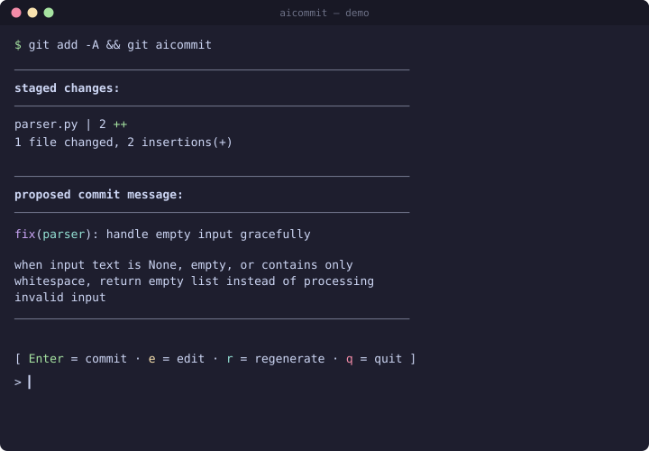

# 🤖 aicommit

Generate Conventional Commit messages from your staged diff, powered by a local LLM. No API keys. No cloud.

[](https://github.com/yumiaura/AICommit/actions/workflows/ci.yml)
[](LICENSE)
[](pyproject.toml)

---

## Contents

- [Features](#features)
- [Requirements](#requirements)
- [Quick start](#quick-start)
- [Configuration](#configuration)
- [Alternatives](#alternatives)
- [License](#license)

---

## Features

- Generates **Conventional Commit** messages from staged changes
- Powered by a **local LLM** via Ollama (or `llama-cpp-python`)
- Opens the proposal in `$EDITOR` for a quick approval / edit / regenerate loop
- `changelog` subcommand: summarizes a tag range into a `CHANGELOG.md` entry
- Installs as a `git` subcommand — call it as `git aicommit`

---

## Requirements

- Python **3.11+**
- An LLM backend, either:
  - **[Ollama](https://ollama.com)** running locally or over the network (default), or
  - **`llama-cpp-python`** with a local GGUF model — `pip install 'aicommit[llama-cpp]'`

---

## Quick start

```bash
# 1. install a model in Ollama (any chat-instruct model works)
ollama pull qwen2.5-coder:7b

# 2. install aicommit straight from GitHub
pip install git+https://github.com/yumiaura/AICommit

# 3. stage and let it write the message
git add -A
git aicommit
```

Sample interaction:



<details>
<summary>Text fallback (if the image above doesn't render)</summary>

```text
────────────────────────────────────────────────────────
staged changes:
────────────────────────────────────────────────────────
 parser.py | 2 ++
 1 file changed, 2 insertions(+)
────────────────────────────────────────────────────────
proposed commit message:
────────────────────────────────────────────────────────
fix(parser): handle empty input gracefully

when input text is None, empty, or contains only
whitespace, return empty list instead of processing
invalid input
────────────────────────────────────────────────────────

[ Enter = commit · e = edit · r = regenerate · q = quit ]
```

</details>

Changelog mode:

```bash
git aicommit changelog v0.4.0..HEAD --out CHANGELOG.md
```

Copy the generated message to your clipboard (useful when you commit from
another tool — IDE, GUI git client, GitHub web UI):

```bash
aicommit --print | pbcopy              # macOS
aicommit --print | wl-copy             # Wayland
aicommit --print | xclip -sel clip     # X11
aicommit --print | clip                # Windows (Git Bash / WSL)
```

---

## Configuration

Quickest way to get a config file:

```bash
aicommit config
```

Creates `~/.config/aicommit/config.toml` from the default template (if
missing) and opens it in `$EDITOR` (fallback `$VISUAL` → `nano`). Existing
files are never clobbered.

**Config keys** — all optional, defaults shown:

| Section | Key | Env var | Default | Description |
|---|---|---|---|---|
| `llm` | `backend` | `AICOMMIT_BACKEND` | `ollama` | `ollama` or `llama-cpp` |
| `llm` | `model` | `AICOMMIT_MODEL` | `qwen2.5-coder:7b` | Ollama tag or GGUF file path |
| `llm` | `url` | `AICOMMIT_OLLAMA_URL` | `http://localhost:11434` | Ollama base URL |
| `llm` | `temperature` | `AICOMMIT_TEMPERATURE` | `0.1` | Sampling temperature |
| `llm` | `max_tokens` | `AICOMMIT_MAX_TOKENS` | `512` | Max tokens in response |
| `commit` | `style` | `AICOMMIT_STYLE` | `conventional` | `conventional` or `plain` |
| `commit` | `include_body` | `AICOMMIT_INCLUDE_BODY` | `true` | Emit a body under the subject |
| `review` | `enabled` | — | `false` | Run `--review` on every commit |
| `changelog` | `skip_conventional` | — | `true` | Use the deterministic fast path when possible |

**Precedence:** defaults → `~/.config/aicommit/config.toml` → `<repo>/.aicommit.toml` → env vars → CLI flags.

**CLI flags** — all override config:

```text
aicommit [--backend {ollama,llama-cpp}] [--model M] [--url URL]
         [--temperature T] [--max-tokens N]
         [--style {conventional,plain}] [--no-body]
         [--review] [--review-only]
         [--print] [--no-stream] [-y/--yes] [--debug] [--version]
aicommit changelog <rev-range> [--out CHANGELOG.md]
aicommit config
```

---

## Alternatives

aicommit lives in a crowded space, and that's fine — these are all good:

| Tool | Stack | Notes |
|------|-------|-------|
| [aicommits](https://github.com/Nutlope/aicommits)       | Node | most popular; many providers, Ollama too |
| [opencommit](https://github.com/di-sukharev/opencommit) | Node | feature-rich; Claude/GPT/Ollama, GitHub Actions |
| [gptcommit](https://github.com/zurawiki/gptcommit)      | Rust | `prepare-commit-msg` hook |
| [CodeGPT](https://github.com/appleboy/CodeGPT)          | Go   | commits + short code review |

**Why aicommit, then?** A few deliberate choices:

- **Local-first, offline by default** — Ollama or in-process `llama-cpp`; no cloud provider to configure, no API keys, nothing leaves your machine.
- **Zero runtime dependencies** for the Ollama backend — just the Python standard library (`urllib` for HTTP, `subprocess` for git, `argparse` for the CLI, `tomllib` for config), so it's easy to audit and quick to install.
- **Conventional Commits** with an approve / edit / regenerate loop in `$EDITOR`.
- **Changelog mode** — summarize a tag range straight into `CHANGELOG.md`.
- Installs as a native `git aicommit` subcommand.

Want the biggest ecosystem? Use aicommits or opencommit. Want a tiny, auditable, Python-native, fully-offline tool? That's aicommit.

---

## License

[MIT](LICENSE) · [@yumiaura](https://github.com/yumiaura)
